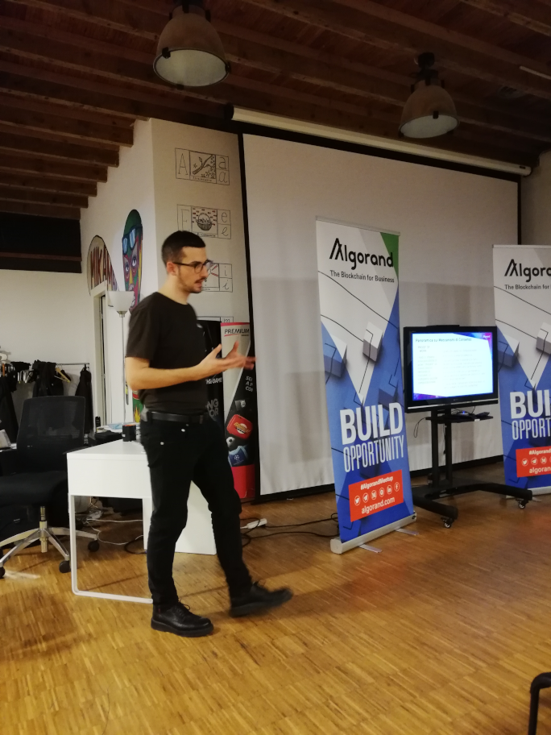
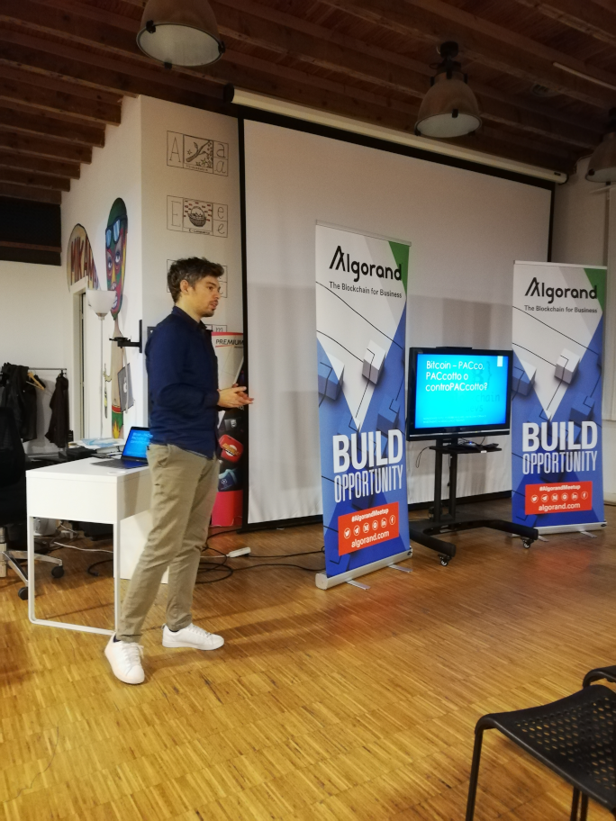

# Incontro 9 - Introduzione ad Algorand e Piano di ACcumulo digitale

Il 21 ottobre 2019 si è tenuto il nono incontro dei Blockchain Devs.

Due i temi trattati.

## Algorand: l'ascesa di una pura proof-of-stake blockchain

[Fabio Tagliaferro](https://www.linkedin.com/in/fabtagliaferro/) ha esposto i principi che regolano la  blockchain di [Algorand](https://www.algorand.com/), una blockchain basata sulla proof-of-stake.
Trovate [qui le sue slides](assets/img/algorand.pdf)

## Piano di ACcumulo digitale

Nel secondo intervento della serata [Jacopo Cocchi](https://www.linkedin.com/in/jacopo-cocchi-46494131/) ci ha instillato un dubbio: e se un Piano di ACcumulo (PAC) basato su bitcoin fosse più conveniente e sicuro di uno tradizionale? Trovate la sua risposta [nelle sue slides](assets/img/PAC.ppsx)

## Swiss Fintech Day

Il Professor Gianfranco Prini ci ha invece informato di un evento interessante organizzato dalla Camera di Commercio Svizzera in Italia: lo [Swiss Fintech Day 2019](assets/img/fintech_ch_19.pdf)

